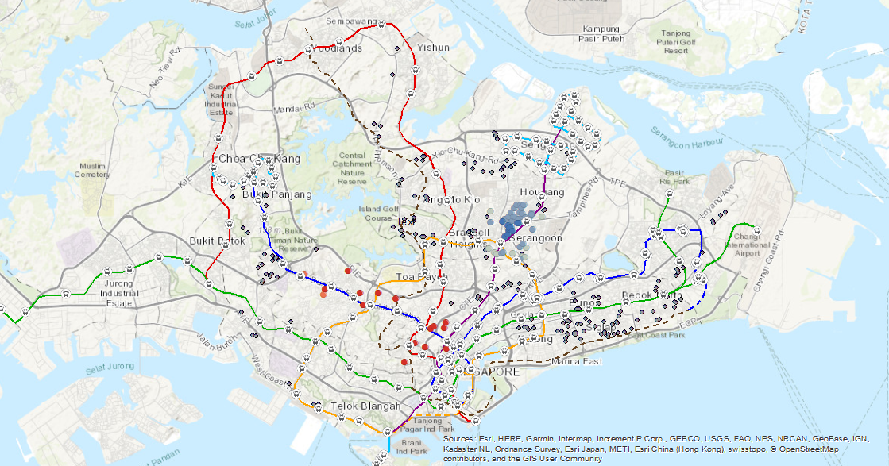
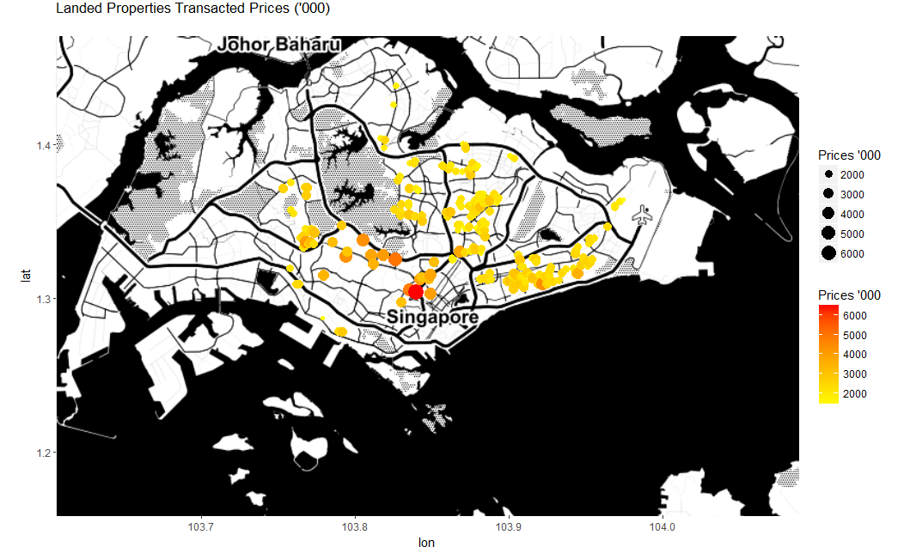

```{r setup, include=FALSE}
knitr::opts_chunk$set(echo = TRUE)
```

## Landed properties in Singapore - the hot and the cold?

Author: Meng Chong Ng

Date: 07/11/2018


According to the 2018 Oct Knight Frank prime global index, Singapore luxury property market is ranked No 1 in the world overtaking cities like London and New York.

## Introduction
Numerous studies had already been made on properties with no foreign ownership restrictions. In this spatial analysis report, we will just focus only on landed properties that can only be bought by Singaporeans or Permanent residents.

One map is created using GUI Arc map and the other map is created using code based R/Rstudio.

## Data sources
The URA space is an online geospatial portal developed by the Urban Renewal Authority of Singapore (URA) with an API data services for free sale transaction download.


## GUI vs Command line generated maps 

#####Benefits of GUI

1) Easy to navigate the software with views and toolbars
2) Click of button to add layers
3) Commerical support available

#####Drawbacks

1) Not automated and slow reproducibility

#####Benefit of CLI

1) Scripted and automated
2) Numerous libraries and packages available
3) Tightly integrated with R powerful statistical and analytical tools


#####Drawbacks

1) High steep learning curve to master a new coding language
2) line by line coding can be slow and laborious


## Workflows

Landed freehold sales transaction data all over Singapore is filtered and extracted into a csv file:

1) Size: 100-200 sqm
2) x,y - spatial co-ordinates (Cross check to streetname and project)
3) Prices

The data is normalised for comparison purpose.

#####ArcMap

1) Map of Singapore is downloaded using the base map online function. 
2) The train line layer is added and csv data file is imported.
3) From ArcToolbox, apply optimised hotspot analysis on house prices




#####R/RStudio

1) The ggmap and rdgal libraries are essential for generating the map.
2) The map of Singapore is downloaded from stamen by supplying the bbox co-ordinates.
3) The same csv data file are imported using spatial dataframe.
4) The map are plotted using the ggplot function.





## Assessment of maps

#####ArcMap
The arcGIS map shows the scattered dotted transactions of property sale across the islands. The train line overlay helps to identify if transactions tend to cluster along the train stations. 

This geoprocessing tool identifies statistically significant spatial clusters of high values (red hot spots) and low values (blue cold spots).


The map results seemed to suggest that rich Singaporeans who can afford a car,living beside the train stations might not be an important consideration.


The unsupervised machine learning technique provide some interesting insights.  The hotspots coincides with the hilly and posh district of Singapore (West Dark Blue train line). The coldspots coincides with the recent developments where land were released by the Singapore government (Northeast purple train line).

#####R/RStudio

The Rmap is generated with a monchromatic Singapore map with higher prices looking like hot spots.The colour gradient scale is possibly a simpler approach to the heatmap or the binning map.

The bright red colour and bigger size in the southern center correctly identifies the most expensive area in Singapore where the Heart of Singapore is.

The map results also seemed to suggest that little premium is required to live by the seaside along the east coast line.

## Other relevant considerations
Due to the small size of Singapore, the standard coordinate system of the latitude and longitude is not suitable. SVY21 datum system is a better approximation to the covering Singapore map projections.

There is notorious heterogeneity in properties and many different factors can have an impact on the prices. However, I would argue that spatial analysis like above is a good tool to help provide better decision making on where to invest in the property market.

## References
[1] Finding a new home using Insights for ArcGIS
http://desktop.arcgis.com/en/analytics/case-studies/finding-new-home-1-overview.htm

[2] Background maps in R
http://rpubs.com/RobinLovelace/ggmap

[3] Chapter 7, 10, 11 of Geographic Information Systems & Science by David J. Maguire, David William Rhind, Michael Frank Goodchild, and Paul Longley

